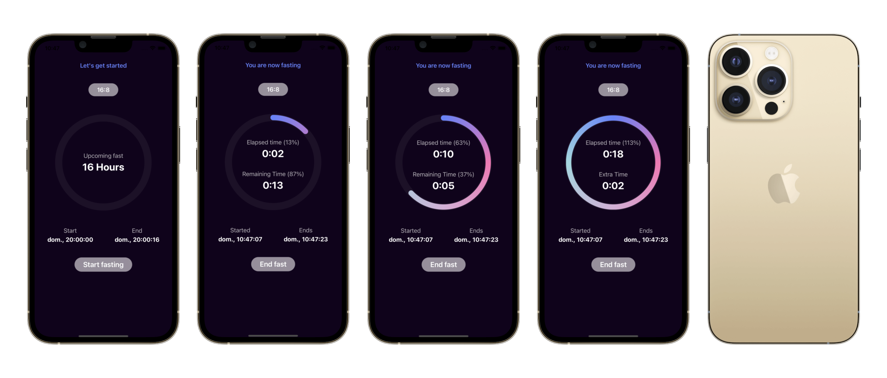

This app is going to help users track their fasting and feeding time. To get you into context briefly, intermittent fasting is gaining worldwide popularity in recent years. It is sort of a diet, but not quite. It’s more a way of life. 

## What you'll build

You’ll learn how to build a fasting app. A diet restricts WHAT you eat whereas IF restricts WHEN you eat. Basically, you can eat whatever you want (hopefully healthy food), but in restricted time called the eating or feeding window. The longer one fasts, the more the body burns stored fat as there are no more sources of energy coming in during that period. People usually fast from 12 to 18 hours a day, can go on to eat one meal a day and even fast many days to heal themselves. The concept of eating small meals but more often, we are getting away from that. There are just too many benefits in fasting, but I won’t go over them. And yes, I do practice intermittent fasting just recently, thus the idea for this app.

